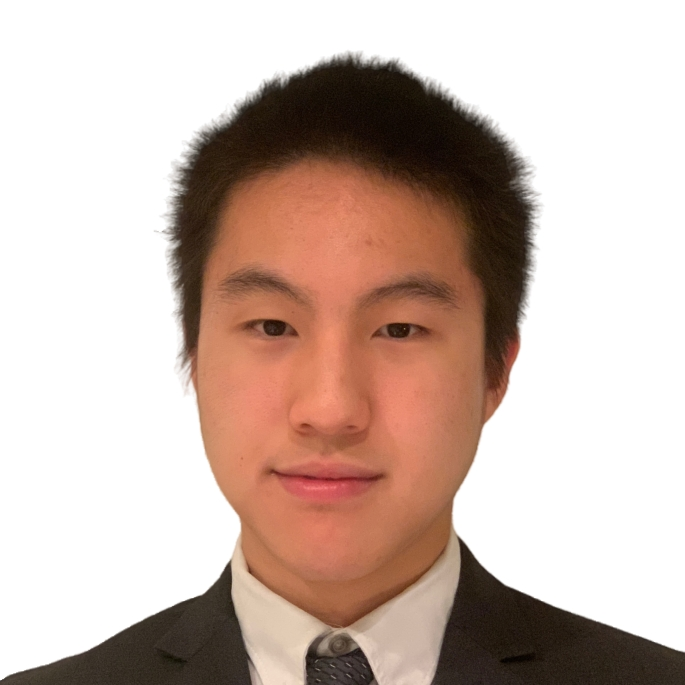

# About Me

## Who Am I

Hello! My name is **Hanwen Chen**, you can also call me **Steven**, this is me below in the picture

I'm a second-year Math-CS student here at UCSD, and I'm taking ***CSE-110***!!!!

## What I Know About Programming

To be honest, I am OK but not super confident with programming. I know programming languages like
Java, Python, C++, C, *etc.*. I know some data structures and algorithms from CSE-100 but have not
actually used them often in real life, so I'm very excited about this class where I can use some of
that knowledge!

## What I Like To Do

- Sleeping
- Eating
- Play video games

## My Favorite Quote

My favorite quote is from a dude in an anime
> Bravery is the testament of humanity

## Top countries I Want To Visit

1. Germany
2. Japan
3. Austria

## Favorite Artist

I love Michael Jackson from the bottom of my heart, here is the link to *Don't Stop 'Till You Get Enough*, one of my favorite song: [Music video](https://www.youtube.com/watch?v=yURRmWtbTbo&list=RDyURRmWtbTbo&start_radio=1)

## Favorite Git Command

My favorite git command is `git status`, other commands I like include:
```git add git commit```

## My Goal of the year

- [x] Be happy
- [ ] Get an internship

## THE END!!

### Notes
My README file
[Read me](README.md)

Go back to the front: [Link Text](#about-me)
